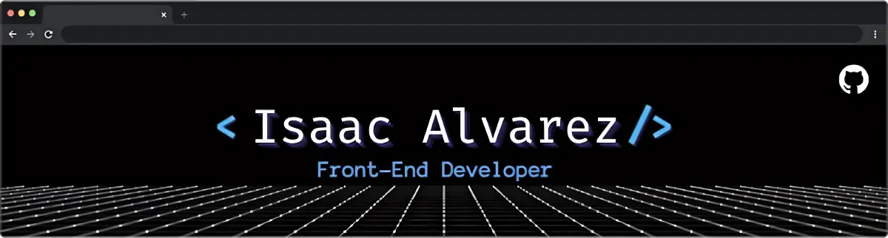
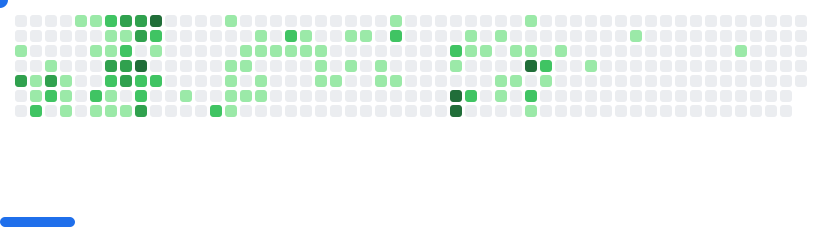
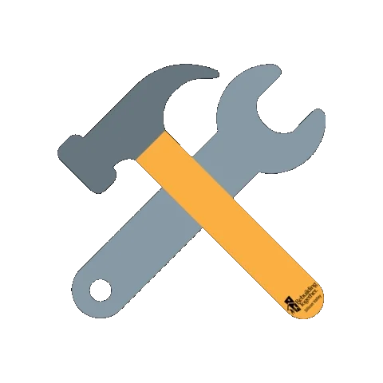

<p align="center">
    <a href="https://github.com/isAlvarezDev"></a>
</p>

<h2>
    
    About Me
</h2>

```javascript
🌍 let located = "I'm based in Aragua, Venezuela."
👨‍🎓 const education = "Systems Engineer at Universidad Bicentenaria de Aragua"
📚 let currentLearning= "Several technologies now to create dynamic and user-friendly web applications."
➡️ let guide = "Following the roadmap.sh guide to expand my skill set"
💼 let availability = print("Open to new opportunities! Looking for a challenging role where I can contribute to a talented team and make a real impact on the world.")
```
<picture>
  <source
    media="(prefers-color-scheme: dark)"
    srcset="images/breakout-dark.svg"
  />
  <source
    media="(prefers-color-scheme: light)"
    srcset="images/breakout-light.svg"
  />
  
</picture>

<h2>
    
    My Favorite Tools
</h2>

[](https://developer.mozilla.org/en-US/docs/Web/HTML)
[](https://developer.mozilla.org/en-US/docs/Web/CSS)
[](https://developer.mozilla.org/en-US/docs/Web/JavaScript)
[](https://web.dev/learn/accessibility)
[](https://git-scm.com/)
[](https://pages.github.com/)
[](https://www.npmjs.com/)

[](https://react.dev/)

[](https://code.visualstudio.com/)
[](https://prettier.io/)


<h2>
    
    Stats
</h2>

<table>
    <tbody>
        <tr>
            <td>
                <picture>
                    <source
                        srcset="https://github-readme-stats.vercel.app/api?username=isAlvarezDev&show_icons=true&theme=github_dark_dimmed"
                        media="(prefers-color-scheme: dark)"
                    />
                     <source
                        srcset="https://github-readme-stats.vercel.app/api?username=isAlvarezDev&show_icons=true"
                        media="(prefers-color-scheme: light), (prefers-color-scheme: no-preference)"
                    />
                    
                </picture>
            </td>
            <td>
                <picture>
                    <source
                        srcset="https://github-readme-stats.vercel.app/api/top-langs/?username=isAlvarezDev&hide=kotlin&layout=compact&theme=github_dark_dimmed"
                        media="(prefers-color-scheme: dark)"
                    />
                     <source
                        srcset="https://github-readme-stats.vercel.app/api/top-langs/?username=isAlvarezDev&hide=kotlin&layout=compact&theme=default"
                        media="(prefers-color-scheme: light), (prefers-color-scheme: no-preference)"
                    />
                    
                </picture>
            </td>
        </tr>
    </tbody>
</table>
